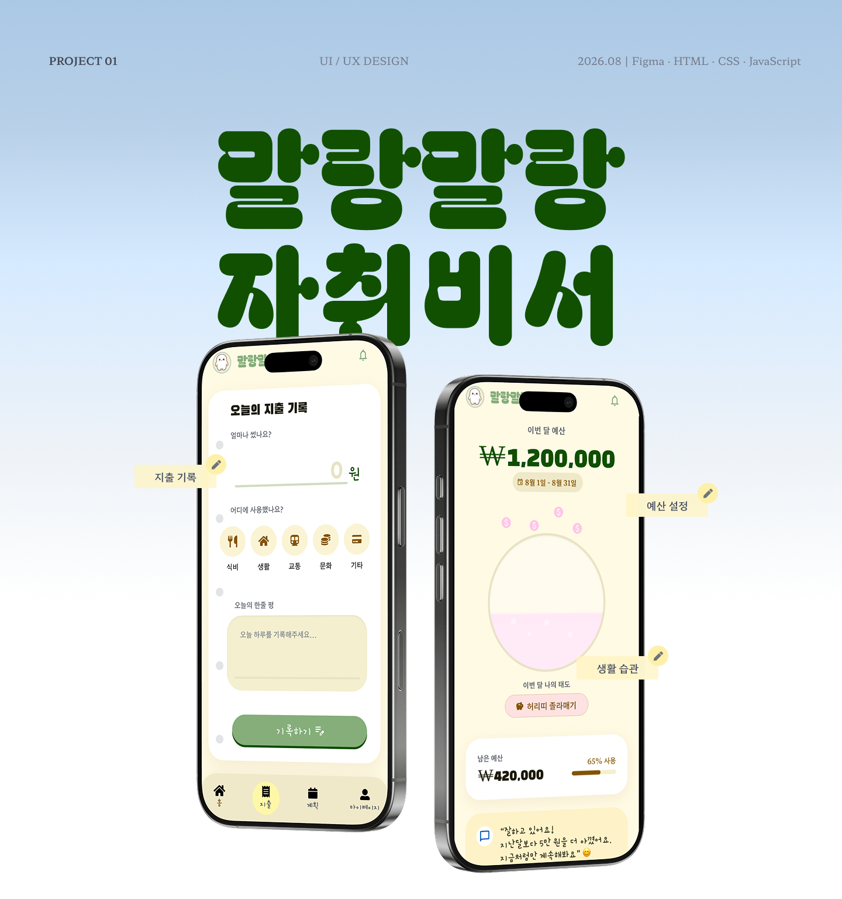

# 말랑말랑 자취비서 — App Showcase



> 1인 가구 생활비 관리 앱 ‘말랑말랑 자취비서’의 문제 정의, 핵심 기능, 사용자 흐름과 디자인을 스크롤 인터랙션으로 소개하는 웹 포트폴리오

> [!NOTE]
> 본 저장소는 실제 동작하는 앱이 아닌, 앱의 기획과 주요 디자인을 웹상에서 보여주기 위해 퍼블리싱된 **원페이지 앱 소개서(쇼케이스) 프로젝트**입니다. 
> 실제 앱 프로젝트는 [App Repository](https://github.com/sjian110-art/-secretary)에서 확인하실 수 있습니다.

## 🔗 링크 모음

* **App Showcase**: [https://sjian110-art.github.io/jachwi-assistant](https://sjian110-art.github.io/jachwi-assistant) (현재 저장소 웹페이지)
* **Live App**: [https://secretary-green312.vercel.app](https://secretary-green312.vercel.app)
* **App Repository**: [https://github.com/sjian110-art/-secretary](https://github.com/sjian110-art/-secretary)
* **Project Plan**: [Notion 바로가기](https://app.notion.com/p/Project-1-73be67e45338833cb96d01270273eeb6)

## 📌 프로젝트 개요

* **제작 목적**: 자취생을 위한 생활비 관리 앱의 기획 의도와 UI/UX 디자인을 효과적으로 전달하기 위한 웹 포트폴리오 구축
* **대상 사용자**: 생활비 관리에 어려움을 겪는 1인 가구 및 자취생
* **앱에서 해결하려는 문제**: 흩어진 지출 내역, 보이지 않는 잔여 예산, 갑작스러운 지출 대비의 어려움
* **소개서 웹페이지의 역할**: 단순한 이미지 나열을 넘어, 사용자 흐름(Flow)과 스토리텔링을 스크롤 인터랙션으로 구현하여 실제 서비스가 제공하는 가치를 생동감 있게 전달

## 💡 주요 소개 내용

소개서 웹페이지는 다음과 같은 내용을 순차적으로 안내합니다.

1. **문제 정의 및 기획 배경**: 자취생이 생활비를 관리할 때 겪는 현실적인 문제 상황과 User Voice를 바탕으로 정리한 기획 배경
2. **브랜드 컬러와 캐릭터**: 친근한 생활비 비서 '몽이(Mongi)' 소개
3. **핵심 기능 01. Budget Planning (예산 관리)**: 한 달 예산 목표 설정 및 실시간 잔여 예산 확인
4. **핵심 기능 02. Daily Record (지출 기록 및 데일리 로그)**: 오늘의 소비 기록, 사진 및 메모가 더해진 데일리 로그, 소비 습관을 보여주는 통계
5. **핵심 기능 03. Emergency Fund Challenge (비상금 챌린지)**: 예상치 못한 순간을 대비하는 나만의 비상금 목표 설정
6. **UI Showcase & Design Concept**: '포근함, 친근함, 명확함'을 주제로 한 컬러 팔레트와 전체 앱 화면 모음
7. **Ending**: 방문 및 확인에 감사하는 마음을 담은 영수증 콘셉트의 엔딩 화면

## 🛠 주요 인터랙션

* **스크롤 기반 화면 전환**: 사용자의 스크롤 뎁스에 맞추어 콘텐츠가 순차적으로 등장(Fade & Slide)
* **앱 화면 및 목업 연출**: 서비스 콘셉트를 보여주는 기기 목업 및 캐릭터 플로팅 애니메이션
* **SVG 드로잉 애니메이션**: 각 핵심 기능으로 넘어가는 과정에서 앱 화면 간의 연결성을 보여주는 시각적 가이드 라인 제공
* **영수증 출력 형태의 엔딩**: 페이지 마지막에서 긴 영수증이 출력되어 내려오는 듯한 콘셉트 인터랙션 구현

*(※ 데스크톱 해상도를 기준으로 설계된 페이지로, 모바일 환경에서는 반응형 레이아웃이 적용되어 있지 않습니다.)*

## 🎨 디자인 방향

* **친근하고 부담 없는 생활비 관리 경험**: 가계부 및 돈 관리가 스트레스로 다가오지 않도록 포근하고 부드러운 분위기 조성
* **브랜드 컬러**: Cream Ivory(#FFFAE3) 배경과 Mongi Green(#85AE7B)을 중심으로, Blush Pink(#FFEFEF), Butter Yellow(#FFF9BC), Tangerine Orange(#FFB95A)를 포인트로 사용해 친근하고 부담 없는 생활비 관리 경험을 표현했습니다.
* **일관된 브랜딩**: 실제 앱의 메인 캐릭터 '몽이'와 UI 디자인 컴포넌트를 웹페이지 레이아웃에 직접 활용하여 프로젝트의 완성도를 높임

## 💻 기술 스택

본 프로젝트(앱 소개서 웹페이지)에 적용된 기술입니다.

* **HTML5 / CSS3**: 시맨틱 웹 구조 설계 및 Flex/Grid 기반 전체 레이아웃 스타일링
* **JavaScript (Vanilla)**: DOM 제어 및 인터랙션 로직 구현
* **GSAP (GreenSock) & ScrollTrigger**: 스크롤 애니메이션 및 복합적인 타임라인 기반 UI 모션 구현

## 📁 프로젝트 구조

```text
jachwi-assistant/
├── index.html         # 웹 포트폴리오 메인 페이지
├── css/
│   └── style.css      # 전체 스타일시트 및 애니메이션 정의
├── js/
│   └── script.js      # GSAP 및 스크롤 인터랙션 로직
└── assets/            # 프로젝트에 사용된 이미지 및 에셋 폴더
    ├── avatars/       # User Voice 프로필 아바타 이미지
    ├── characters/    # 브랜드 캐릭터(몽이) 에셋
    ├── mockups/       # 디바이스 프레임이 적용된 앱 목업
    ├── screens/       # 기능 설명을 위한 실제 앱 화면
    ├── showcase/      # UI 모음(Showcase)에 사용된 썸네일 화면들
    ├── story/         # 기획 배경 스토리에 사용된 이미지
    ├── ui-elements/   # 기타 UI 디자인 요소
    └── decorations/   # 영수증 바코드 등 장식 요소
```

## 🚀 실행 방법

본 프로젝트는 정적 웹사이트이므로 별도의 Node.js 환경이나 설치 과정이 필요하지 않습니다.

1. **저장소 클론**
   ```bash
   git clone https://github.com/sjian110-art/jachwi-assistant.git
   ```
2. **로컬 실행**
   * 다운로드 받은 폴더로 이동한 후 `index.html` 파일을 더블 클릭하여 웹 브라우저에서 바로 확인할 수 있습니다.
   * 또는 VS Code의 Live Server 확장 프로그램을 사용하여 로컬 서버 환경에서 확인할 수 있습니다.

## ✍️ 작업 과정과 역할

* **담당 업무**: 앱 기획, UI/UX 디자인, 웹페이지 레이아웃 구성, 에셋 정리, 인터랙션 설계, 퍼블리싱 및 배포
* **제작 방식**: 전반적인 디자인 방향성 설정과 UI 완성, 에셋 구성 등 최종 판단은 디자이너가 주도적으로 진행하였으며, 마크업 구조화 및 스크롤 애니메이션 스크립트 작성 등 웹 퍼블리싱 구현 과정에서 AI 도구의 보조를 활용하여 완성도를 높였습니다.

## 🌱 개선 가능 사항

* **반응형 웹 최적화**: 현재 데스크톱 뷰포트에 고정되어 있는 레이아웃을 모바일 기기에서도 유연하게 볼 수 있도록 미디어 쿼리(Media Query) 적용 필요
* **웹 접근성 개선**: 시각 장애인 및 스크린 리더 사용자를 위해 이미지 태그의 `alt` 속성 보강 및 WAI-ARIA 속성 추가
* **이미지 로딩 성능**: 페이지 내 다수의 고화질 이미지(앱 화면 및 목업)로 인한 초기 로딩 지연을 해결하기 위해 WebP 포맷 변환 및 Lazy Loading 적용 고려

## 📄 저작권 및 제작자

* **Designer & Developer**: LEE JIYEON
* © 2026 LEE JIYEON. All rights reserved.
